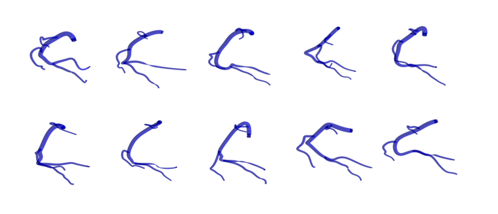

# 3D Vessel Tree Generator

This repository can be used to generate random vessels or vessel trees. 
Vessel trees are encoded and saved as an MxNX4 matrix, where M is the number of branches in the tree, 
N is the number of interpolated centerline points per branch, and the last dimension corresponds to the (x,y,z) coordinates and radius r for each centerline point.




The vessel tree generator is highly customizable. Many parameters are randomized by default but can be specified if the user would like more control over the geometries.
Parameters include:
 - vessel tree type: cylinders, random splines, or right coronary tree
 - vessel dimensions including length and maximum radius
 - constant radius, linearly tapered radius, or user-specified radius
 - number, position, and severity of stenoses
 - relative positions and dimensions of side branches
 
An info file is saved for each geometry which contains the parameters used to construct it.

## Dependencies
numpy\
matplotlib\
scikit-image (skimage)\
[NURBS-python](https://nurbs-python.readthedocs.io/en/5.x/install.html) (geomdl)

## Usage

```commandline
python ./tube_generator.py --save_path="/path/to/save" --dataset_name="test" --num_trees=10 --num_branches=3 --vessel_type='RCA' --shear
```

`tube_generator.py` contains optional code to generate random binary projections of the 3D geometries.

For each generated geometry, the output will be:
- numpy file containing MxNx4 matrix
- info.0 JSON file containing parameters used for data generation
- binary projection images (optional)


The output directory structure will be as follows:

-- save_path directory\
&nbsp; &nbsp; --> dataset_name directory\
&nbsp; &nbsp;&nbsp; &nbsp; --> labels\
&nbsp; &nbsp;&nbsp; &nbsp;&nbsp;&nbsp; - 0000.npy\
&nbsp; &nbsp;&nbsp; &nbsp;&nbsp;&nbsp; - 0001.npy\
&nbsp; &nbsp;&nbsp; &nbsp;&nbsp;&nbsp; - 0002.npy\
&nbsp; &nbsp;&nbsp; &nbsp; --> info\
&nbsp; &nbsp;&nbsp; &nbsp;&nbsp;&nbsp; - 0000.info.0\
&nbsp; &nbsp;&nbsp; &nbsp;&nbsp;&nbsp; - 0001.info.0\
&nbsp; &nbsp;&nbsp; &nbsp;&nbsp;&nbsp; - 0002.info.0\
&nbsp; &nbsp;&nbsp; &nbsp; --> images (only if using `--generate_projections` flag)\
&nbsp; &nbsp;&nbsp; &nbsp;&nbsp;&nbsp; - image0000a.png, image0000b.png, image0000c.png\
&nbsp; &nbsp;&nbsp; &nbsp;&nbsp;&nbsp; - image0001a.png, image0001b.png, image0001c.png\
&nbsp; &nbsp;&nbsp; &nbsp;&nbsp;&nbsp; - image0002a.png, image0002b.png, image0002c.png


### To do:

- implement left coronary tree, other vessels
- implement cosine profile stenoses

## Citation
If you find this work useful, please cite the following:

**A Machine Learning Approach for Coronary 3D Reconstruction from Uncalibrated X-ray Angiography Images. Iyer, K., Nallamothu, B.K., Figueroa, C.A., Nadakuditi, R.R. *In preparation*.**